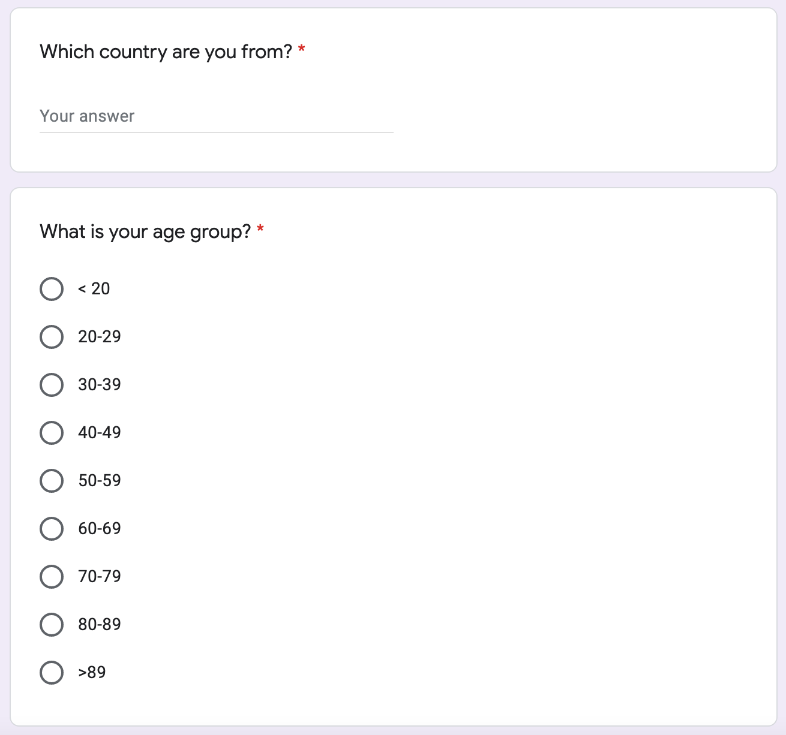
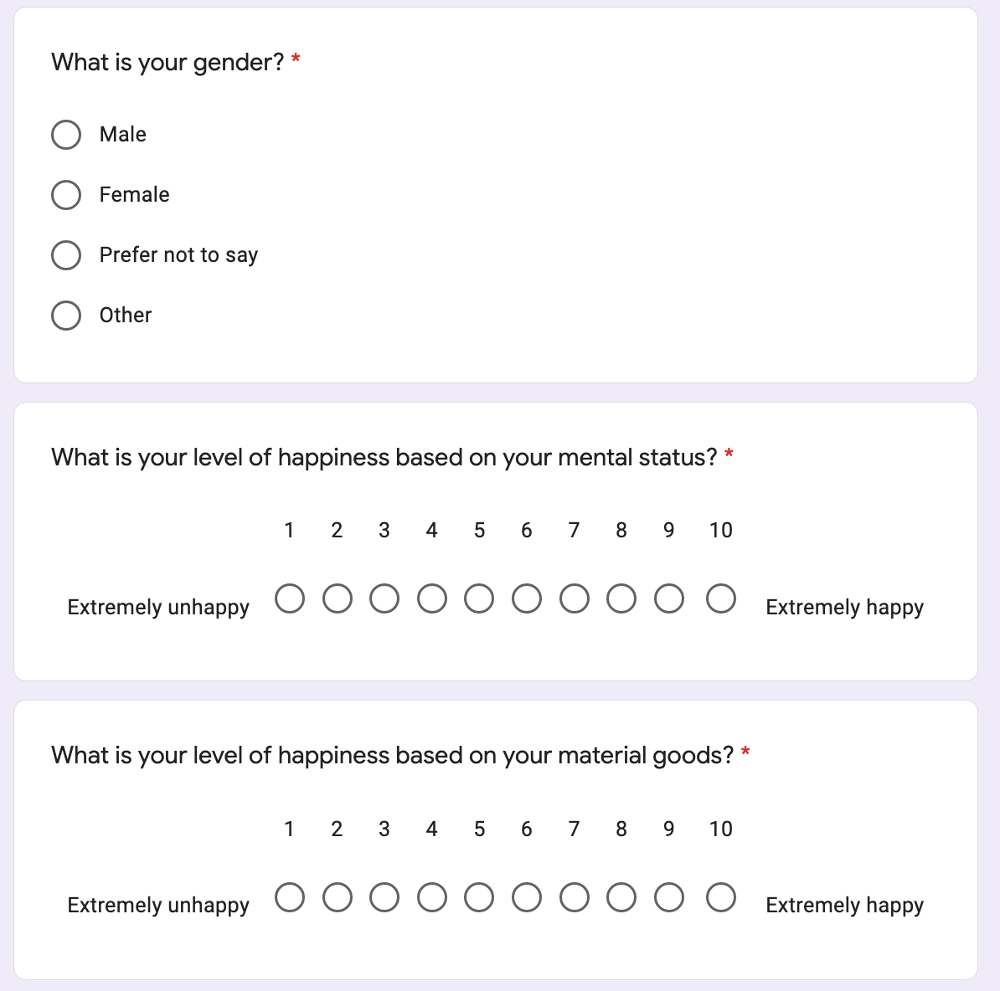
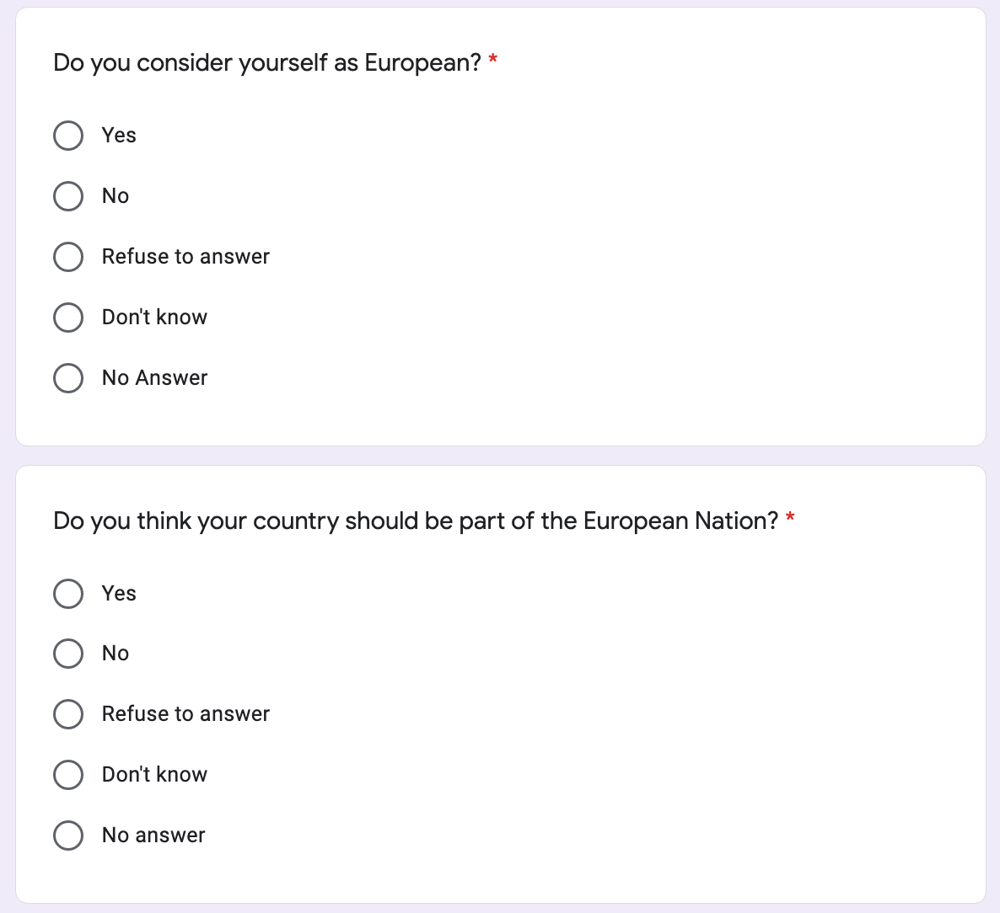
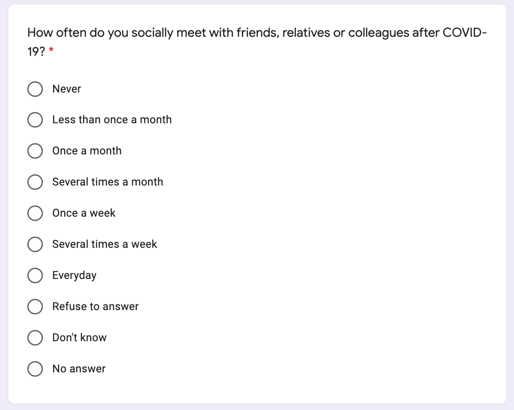

```{r setup, include=FALSE, show_col_types = FALSE}
# install.packages("haven")
# install.packages("tidyverse")
# install.packages("dplyr")
# install.packages("janitor")
# install.packages("tidyr")
# install.packages("ggplot2")
# install.packages("lubridate")
# install.packages("gridExtra")
# install.packages("scales")
# install.packages("knitr")
library(haven)
library(tidyverse)
library(dplyr)
library(janitor) # Helps clean datasets
library(tidyr) # Helps make tidy datasets
library(ggplot2)
library(lubridate)
library(gridExtra)
library(scales)
library(knitr)
library(kableExtra)

knitr::opts_chunk$set(echo = FALSE)

# set working directory to project directory: 
# session > set working directory > To Project Directory 
# Read in the raw data. 
raw_data <- readr::read_csv("../../inputs/data/ESS9e03_1.csv")

```
# Introduction

The European Social Survey (ESS), developed in 1995 was created to measure social attitudes, beliefs and behavior patterns across Europe and its intended to be used by academics, researchers and policy makers. The main goals of the ESS are to collect data on social structure, political attachment, citizen’s perceptions and judgement towards their societies. In doing so, it aims to determine how Europe’s social and political views are changing and to promote a high standard of research in social sciences across Europe. Every two years, they also conduct face-to-face interviews with randomly selected individuals using various random probability methods. These elected few individuals are asked over 200 questions about socio-demographics which are then analysed by age, gender, economic status, ethnicity among other factors to understand the differences among each demographic (@ESSAboutCitation ). Results from all participating countries are pooled together and individuals made anonymous so the resulting data can be made publicly available. 

Since its establishment, the ESS won the Descartes Prize for Research & Science communication in 2005 and awarded the European Research Infrastructure Consortium (ERIC) in 2013 thus becoming a legal entity recognized by governments of the participating countries. Data collected by ESS is used across the world to not only advance scientific discussions but also to improve the quality of survey methodology and the improve the data collection methods and to develop a better understanding on social sciences in terms of measuring, data collection and in doing so promote positive change around the world (@ESSAboutCitation).

# Data

## Data Summary

## R Packages

We will be using R [@citeR] throughout the whole research with the aid of different packages provided by R.  **dplyr** [@dplyr] is used for data manipulation focusing on data frames, **tidyverse** [@tidyverse] is used for data exploration and visualization, **janitor** [@janitor], **tidyr** [@tidyr] and **lubridate** [@lubridate] are used for cleaning the data set so the developer can analyze the data in a more organized way while **ggplot2** [@ggplot], **gridExtra** [@gridExtra], **kableExtra** [@kableExtra] and **scales** [@scales] are the most important packages because they are used to generate graphs and table in order for us to present our findings. We will be using pie charts, histograms and tables to deliver our findings, based on our data characteristic, different types of graphs/tables will come in handy. 

```{r, echo=FALSE, warning=FALSE, show_col_types = FALSE}
question_code <- c("C1",
             "C7",
             "C9",
             "C10",
             "C13",
             "C18",
             "C19",
             "C21",
             "C23",
             "C24",
             "C25",
             "C28",
             "C30")
question_text <- c("Taking all things together, how happy would you say you are?",
                   "How would you say your health is in general?",
                   "How emotionally attached do you feel to [country]? 0 not at all emotionally attached and 10 means very emotionally attached.",
                   "How emotionally attached do you feel to Europe?",
                   "Have you ever considered yourself belongind to any particular religion or denomination?",
                   "Would you describe yourself as being a member of a group that is discriminated against in this country?",
                   "On what grounds is your group discriminated against?",
                   "What citizenship do you hold? ",
                   "In which country were you born?",
                   "What year did you first come to live in [country]?",
                   "What language or languages do you speak most often at home?",
                   "In which country was your father born?",
                   "In which country was your mother born?")

country_codes_df <- data.frame(question_code, question_text)
names(country_codes_df) <- c("Question Code", "Question Text")
country_codes_df <- country_codes_df[,1:2]
#formattable(country_codes_df)

```

```{r subjectiveQuestionsTable, echo=FALSE, warning=FALSE,show_col_types = FALSE}
country_codes_df %>% 
  kable(
    caption = "Questions",
    align = 'l'
  ) %>%
  kable_styling(latex_options = "HOLD_position", font_size = 6.5)
```

# Survey Methodology
## Features
Core sections in the Europe Social Survey (ESS) are designed as a time series to monitor the change in attitudes and values across Europe. The questions range between various topics of interest in social sciences with a comprehensive set of socio-structural variables. For this paper, we will be focusing on the Questions C1 – C42. This core module features subjective wellbeing, social exclusion, crime, religion, perceived discrimination, national and ethnic identity, political sentiments and voting intentions in EU referendum. 

All of the core sections in the source questionnaire provided by the ESS [@ESSQuestionnaire] are detailed below:
* A1 – A6: Media use; Internet use; social trust.
* B1 – B43: Politics including political interest, trust, electoral and other forms of participation, party allegiance, socio-political orientations, immigration.
* C1 – C42: Subjective wellbeing, social exclusion, crime, religion, perceived discrimination, national and ethnic identity, test questions (political sentiments), vote intention in EU referendum.
* F1 – F61: Socio-demographic profile including household composition, sex, age, marital status, type of area, education & occupation of respondent, partner, parents, union membership, income, and ancestry.
* H: Human values scale.
* I: Test Questions (social situation and reaction)

## Sampling Population
All participating countries in the ESS must aim for a sample size of at least 1500 if they have a population of at least 2 million and a sample size of at least 800 if they have a population less than 2 million. The target population is including all persons of age 15 and upwards within private households of a participating country, regardless of their nationality, citizenship, or language. The ES Sampling Guidelines [@ESSGuidelines] provide detailed explanations to remove any ambiguity in defining the target population.
When determining age in a survey design, the calendar type and time of the year are crucial. We assume the World Calendar (Gregorian Calendar) is used here and the legal age of 15 is defined at the beginning of the survey year on September 1st if the sample is from the register or at the day of interview selection. 
ESS defines the term “private household” as any one person or group of people living in the same dwelling unit with its own lockable front door. Each “dwelling unit” excludes basic facilities that could be shared with occupants of other dwelling units. To put simply, a bedroom that is self-contained. 
Lastly, to account for residents entering and leaving the country, a 6-months threshold is in place. People who are away for less than 6 months are included and people who are, or will be, away for 6 months or longer will not be included.

## Sampling Method
The ESS utilizes a mixture of cluster and stratified sampling by dividing the European population into their respective participating countries with strict random probability methods, which implies that every member of the ESS target population within a participating country should have a disclosed probability greater than zero of being selected. That also means quota sampling is strictly prohibited due to its non-probabilistic nature (which is usually used in time and resource limited projects but not in the case of ESS)
ESS also assumes no associations between selection probabilities and survey variables. Associations may improve precision of certain estimates and worsen precision of others. By assuming of no association, this gives a sort of “averaging” effect for statistical precision. 

## Strengths
The ESS survey design has done an effective job in asking applicable questions. For instance, C13 asks “Have you ever considered yourself as belonging to any particular religion or denomination?” If the respondent answers Yes, then the respondent will be directed to C14 to ask which religion specifically (e.g., Roman Catholic, Protestant, Islamic, etc.). If the respondent answers No, then the respondent will skip C14 as it wouldn’t be relevant question to ask for a specific religion if the respondent isn’t religious in the first place. This design choice ensures efficiency and logical flow in the survey. 
	An interesting design choice of the survey is prompts that instruct the respondent to read questions out loud. By doing so, the survey can invoke desired sentiments that the survey desires to capture. It is not a common implementation but also helps the respondents understand the question better and enforce the accuracy of their answers. 

## Weaknesses
There are some notable weaknesses in the source questionnaire. Many questions that are asked on the ESS utilizes a rating scale which converts opinions into numerical values that would be easy to compute for analysis. The disadvantage would be the rating is subjective and can be interpreted differently by each respondent, leading to inaccurate measurements in our data.
Since the ESS is a census after all and the survey coverage is enormous, this only allows for closed-form questions where respondents are restricted to only multiple choice. This filters out new insights of the respondents’ minds that could potentially lead to improved or new questions to the survey which is reasonable for the purpose of a census but still forces the respondents to respond a certain way. At least to remedy inaccuracies that could occur in forced responses, “refusal” and “don’t know” choices are included. 
Another point of weakness to note is the switch between statements and questionings from C32 to C40 which could cause inconsistency in the survey’s formatting. These questions take the form of statements as we see in C33: “The government in [country] protects citizens against poverty.” The survey attempts to follow-up with an anonymous question later such as C36 that asks, “please tell me to what extent you think the government in [country] protects citizens against poverty?” We can also note the inconsistent multiple-choice scale and page-formatting as well as the sheer number of footnotes, which all could factor in confusing respondents. 

## How Non-Responses are Handled
The ESS classifies non-responses as “refusals”, “non-contacts” or” ineligibles”. In the case of non-response, the ESS does not allow substitution of non-responding households or individuals which entails another household or family member volunteers to take the survey in place of the respondent. The minimum target response rate is 70 percent and in pursuit of these higher response rates, the ESS takes steps in monitoring fieldwork, training interviewers to better obtain cooperation, provide flexible times, and creating incentives for respondents. Higher response rates help minimize the probability of non-response bias, and post-stratification weights are applied to account for unequal representation of strata. Further analysis on strata will better guide to balancing the response rate across any underrepresented subgroups in future rounds. 

# Questionaire Discussion

Some questions present in the European Social Survey (ESS) aim to quantify qualitative measures such as those asking about happiness and emotions. Each respondent can select from a scale of 00-10 and they also have the option for “refusal” or “don’t know”. The benefit for the latter two options provides a convenience because all questions responded with “refusal” can be discarded. A better option for “refusal” is “Don’t know” because participants are more likely to respond with a “Don’t know” as compared to a “refusal”. A benefit to this is that this particular question can be ignored rather than discarding all information from all questions for a particular respondent (@IncludeNeutralPointInQuestionsCitation).

It is however a good measure for determining how someone perceives their current condition with some limitations. For example, Question C1 (Taking all things together, how happy would you say you are?). Questions C9 and C10 aim to quantify how emotionally attached the respondent feels towards their own country and Europe respectively, see table \@ref(tab:subjectiveQuestionsTable) for questions corresponding to each code. All three of these questions expect a response on a scale from 00-10 but it is challenging to compare the same response for two people. If two people select 06 for question C1, how can policymakers be sure that they are equally happy? Similarly, how can policymakers be sure that someone who selected 06 is in fact less happy than someone who selects 07 or is happier than someone who selects 05. Extending this further, how can one be certain that someone who select 06 is in fact twice as happy as someone who selects 03. Additionally, for question C9 and C10, how can we compare two people who both selected 06 for their emotional attachment to their country and Europe, how do we ensure that both people are equally emotionally attached given the same response? (@ProblemsWithMeasuringHappinessCitation)

Trying to quantify such qualitative measures is difficult because the questioned mentioned in table \@ref(tab:subjectiveQuestionsTable) require a subjective opinion which may depend on a person’s own socioeconomic status, culture, environment, psychological or their mood at this particular instance. All of these lead to ambiguity in the responses for such questions.

Furthermore, there are also some questions which require a binary response (yes and no) to avoid any ambiguity in the responses. For example, question C13 and C18 (refer to table \@ref(tab:subjectiveQuestionsTable)) whether the respondent considers themselves to be religious and whether they would describe themselves a member of a group that is discriminated against in their country respectively (see figure). Although a yes/no style question removes any ambiguity it might raise additional questions when the respondent does not fully match the criteria for the provided possible responses. In the case of question C13, if someone is religious sometimes, they might consider themselves somewhere in between the “yes” and “no” options. But given the current responses of “yes”, “no” “refusal” and “Don’t know”, they might lean towards selecting “Don’t know” because they don’t see an option that best describes their response. (@YesNoQuestionsCitation )

Along with some shortcomings discussed above, there is flexibility in this questionnaire because it provides a wide range of options for the respondent to choose from. This limits the chances of there being any common options left out. In addition to this, various questions, including C19, C21, C23, C24, C25, C28, C30 (refer to table \@ref(tab:subjectiveQuestionsTable)) also allow for the respondent to enter their own response if their response cannot be categorized among the provided options or if the question requires a response that will be different for each person such as C24 asking about a the year the respondent came to the particular country. Refer to table \@ref(tab:subjectiveQuestionsTable) for the corresponding questions. 

```{r, echo=FALSE, warning=FALSE,show_col_types = FALSE}
# Removing columns where all values are NA
reduced_data <- 
  raw_data[ , colSums(is.na(raw_data)) < nrow(raw_data)]

# Get all the data related to Subjective well-being, social exclusion, religion,
# national and ethnic identity
europe_data <- select(raw_data, c(1:6, 115:200))

# Write the Europe data to our raw data csv
write_csv(
  x=europe_data,
  file = "../../inputs/data/raw_data.csv"
)
  
# Clean names
survey_data <-
  read.csv("../../inputs/data/raw_data.csv")

# Clear the memory of the raw and reduced data
rm(raw_data)
rm(reduced_data)


# Recode the country name so that people can easily understand the meaning of the code
# Info of the country code is obtained from https://www.iban.com/country-codes
survey_data <-
  survey_data %>%
  mutate(
    cntry = 
      recode(
        cntry,
        'AT' = 'Austria',
        'BE' = 'Belgium',
        'BG' = 'Bulgaria',
        'HR' = 'Croatia',
        'CY' = 'Cyprus',
        'CZ' = 'Czech Republic',
        'DK' = 'Denmark',
        'EE' = 'Estonia',
        'FI' = 'Finland',
        'FR' = 'France',
        'DE' = 'Germany',
        'GR' = 'Greece',
        'HU' = 'Hungary',
        'IE' = 'Ireland',
        'IT' = 'Italy',
        'IS' = 'Iceland',
        'LV' = 'Latvia',
        'LT' = 'Lithuania',
        'SK' = 'Slovakia',
        'SI' = 'Slovenia',
        'ES' = 'Spain',
        'GB' = 'UK',
        'PT' = 'Portugal',
        'PL' = 'Poland',
        'NL' = 'Netherlands',
        'SE' = 'Sweden',
        'RS' = 'Serbia',
        'NO' = 'Norway',
        'ME' = 'Montenegro',
        'CH' = 'Switzerland'
      )
  )

```


```{r, echo=FALSE, warning=FALSE,show_col_types = FALSE}
# get the data of the cntry happiness and summarise them with their mean
# rename cntry to region
cntry_happiness <- subset(survey_data, select = c(cntry, happy))
mapping <- 
  cntry_happiness %>%
  drop_na(happy) %>%
  group_by(cntry) %>%
  summarise_at(vars(happy), list(score = mean)) %>%
  rename(region = cntry)

# generate the world and left join it with our mapping data frame
mapdata <- map_data("world")
#view(mapdata)
mapdata <- left_join(mapdata, mapping, by='region')

# filter those data that has no score
mapdata1 <- mapdata %>% filter(!is.na(mapdata$score))

# plot the map out and colour them
happiness_map <- ggplot(mapdata1, aes(x=long, y=lat, group=group)) +
  geom_polygon(aes(fill=score), color = "black") 

happiness_map <- happiness_map +scale_fill_gradient(name = "score", low = "cyan", high = "purple", na.value = "grey50") +
  theme_void()


```


```{r happinessMap, fig.cap="Density Map of the Happiness Level of different European Countries", echo=FALSE, warning=FALSE,show_col_types = FALSE}
happiness_map
```


# Findings

## Level of happiness

A significant measure for a person’s social wellbeing and quality of life is their perceived happiness and as such, it was the first question asked in section C of the ESS (refer to C1 in table \@ref(tab:subjectiveQuestionsTable).  From the map in figure \@ref(fig:happinessMap), the majority of European countries who participated in the ESS are very happy with a score of 7 of greater with a few outliers scoring less than 7. For those 3 countries that scored less than 7, all of them have a score between 5 and 7. From this we can interpret that the vast majority of European countries are fairly happy with a few outliers that are not; all of which are located in south eastern Europe. 

In contrast, countries with a high happiness score are located in Northern Europe and the rest of Europe (eastern and central) is still fairly happy but they lie in between. Of all the countries, Denmark, a geographically small country located in central Europe has the highest happiness score among all highlighted in dark purple in in figure \@ref(fig:happinessMap). Refer to figure in the Appendix for a relative comparison of happiness with named countries. The country with the lowest happiness score, is Bulgaria highlighted in cyan in figure \@ref(fig:happinessMap).


```{r, echo=FALSE, warning=FALSE,show_col_types = FALSE}
# How often socially meet with friends, relatives or colleagues
social <- subset(survey_data, select = c(cntry, sclmeet)) 
#unique(social$sclmeet)

social <- social %>%
  group_by(sclmeet)

social_table <- table(social$sclmeet)

# get all the labels of the chart
lbls <- c("Never", "Less than once a month", "Once a month", 
            "Several times a month", "Once a week", "Several times a week",
            "Everyday", "Refusal", "Don't know", "No answer")

s_data <- data.frame(lbls, social_table)
s_data <- subset(s_data, select = c(lbls, Freq))


```

## Social Meetings

ESS also collects data on how frequently people meet up socially with their friends, relatives and colleagues, results of the findings are summarized in figure \@ref(fig:socialPieChart). From this figure, over a quarter of all respondents take part is social meetups several times per week, followed 
closely by several times a month and once a week. Close to 75% of all respondents engage in some form of social gathering at least once per week (from atleast once per day to several times per week). In contrast, Less than a quarter meet up at most once per month; among this quarter, under 2% don't meet up at all. On a whole, most respondents meet up in social gatherings fairly frequently across all members of participating in the ESS.

```{r socialPieChart, fig.cap="How often socially meet with friends, relatives or colleagues", echo=FALSE, warning=FALSE,show_col_types = FALSE}
ggplot(s_data, aes(x="", y=Freq, fill=lbls)) +
  geom_bar(stat="identity", width=1) +
  coord_polar("y", start=0) +
  theme_minimal() +
  labs(x="", y="", title = "How Often People Meet with Friends, Relatives or Colleagues")

#(858/sum(s_data$Freq) * 100)
```


## Emotional attachment

Another important aspect that ESS examined is the emotional attachment of the people to their own countries and Europe. They examine this aspect as part of the national and ethics identity, we can tell from this data whether or not the citizens from this country are satisfied with their own government or not. People who do not support their own countries tend to be less emotional attached to them. Below we want to figure out how they feel and identity themselves about their sense of belongings to their countries and Europe. 

```{r, echo=FALSE, warning=FALSE,show_col_types = FALSE}
# plot the graph of how emotionally attached to their countries and Europe
emotional_attach <- subset(survey_data, select = c(cntry, atchctr, atcherp))
# convert them from int to char
emotional_attach$atchctr <- as.character(emotional_attach$atchctr)
emotional_attach$atcherp <- as.character(emotional_attach$atcherp)

# plot the graphs
country_emo <- emotional_attach %>%
  drop_na(atchctr) %>%
  ggplot(mapping = aes(x=atchctr)) +
  geom_histogram(stat= 'count', color="darkblue", fill="lightblue") +
  theme_minimal() +
  labs(x= "How emotionally attached to their own countries")


eu_emo <- emotional_attach %>%
  drop_na(atcherp) %>%
  ggplot(mapping = aes(x=atcherp)) +
  geom_histogram(stat= 'count', color="darkred", fill="red") +
  theme_minimal() +
  labs(x= "How emotionally attached to Europe")
```

```{r emotion, fig.cap = "Emotional attachment", echo=FALSE, warning=FALSE,show_col_types = FALSE}
grid.arrange(country_emo, eu_emo, nrow=1)
```

As displayed in the two histograms in figure \@ref(fig:emotion), we can notice that mostly of the people are pretty attached to their own countries. The scale is from 1 to 10 with 1 being the least attached and 10 being the most attached. When it comes to their own countries, most of the responds were between 8-10 while the number of responds between 1-5 only take up a really small portion. However when it comes to Europe, the responds had a different trend. The number of responds between 8-10 was greatly decreased compared to their own countries. They tend to feel less emotionally attached to Europe, even though they are part of the European Nation, they do not seem to have a huge sense of belongings to Europe. Another observation we have noticed is the number of responds of "88" in the Europe histogram has an unusual raise, "88" refers to "Don't know" which means that some people never considered or classified themselves as European.

## Religious

Europe has always be famous for its long lasting religious culture, we can notice lots of buildings and places in Europe are influenced by different religion. For example Vatican City is one of the world's most famous city known for its catholic religion, it is where the head of all catholic churches, the pope, lives and the Roman Curia makes all the decisions including the elections.


```{r, echo=FALSE, warning=FALSE,show_col_types = FALSE}
# get the data related to religious
religious <- subset(survey_data, select = c(cntry, rlgdnm, rlgdnme))
religious$rlgdnm <- as.character(religious$rlgdnm)
religious$rlgdnme <- as.character(religious$rlgdnme)

# recode the religious status so we can easily see them in the graphs
religious <- 
  religious %>%
  mutate(
    rlgdnm = 
           recode(
             rlgdnm,
             '1' = 'Roman Catholic',
             '2' = 'Protestant',
             '3' = 'Eastern Orthodox',
             '4' = 'Other Christian denomination',
             '5' = 'Jewish',
             '6' = 'Islam',
             '7' = 'Eastern religions',
             '8' = 'Other Non-Christian religions',
             '66' =	'Not applicable',
             '77' =	'Refusal',
             '99' =	'No answer'
             
           ))

religious <- 
  religious %>%
  mutate(
    rlgdnme = 
      recode(
        rlgdnme,
        '1' = 'Roman Catholic',
        '2' = 'Protestant',
        '3' = 'Eastern Orthodox',
        '4' = 'Other Christian denomination',
        '5' = 'Jewish',
        '6' = 'Islam',
        '7' = 'Eastern religions',
        '8' = 'Other Non-Christian religions',
        '66' =	'Not applicable',
        '77' =	'Refusal',
        '99' =	'No answer'
        
      ))

# generate the 2 graphs using ggplot
current_reli <- religious %>%
  drop_na(rlgdnm) %>%
  ggplot(mapping = aes(x=rlgdnm)) +
  geom_histogram(stat= 'count', color="darkgoldenrod", fill="darkgoldenrod1") +
  theme_minimal() +
  labs(x= "Religion or denomination \n belonging to at present") +
  coord_flip()

past_reli <- religious %>%
  drop_na(rlgdnme) %>%
  ggplot(mapping = aes(x=rlgdnme)) +
  geom_histogram(stat= 'count', color="green", fill="lightgreen") +
  theme_minimal() +
  labs(x= "Religion or denomination \n belonging to in the past") +
  coord_flip()
```

```{r reli, fig.cap="Religious or denomination belongings", echo=FALSE, warning=FALSE,show_col_types = FALSE}
grid.arrange(current_reli, past_reli, nrow=2)
```

When we take a look at figure \@ref(fig:reli), we can see that in the graph on people religion at present, majority of the people who have a religion or denomination belonging are Roman Catholic, with Protestant and Eastern Orthodox being the other two major sections, the rest of the options only take up a relatively small portion of the data. 

However if we look at the graphs of people's religion or denomination belongings in the past, surprisingly most of the people do not have any religion or denomination belongings. Over 90% of the people participated in the survey were non-religious in the past, there are more than 40,000 people responded with "Not applicable", however the number dropped to 20,000 in the recent survey, so half of them started to become religious or have their own denomination belongings as they get older. This is an interesting phenomenon because we predicted that the portion of "Not applicable" should only take up a tiny portion, we will investigate more in the later section.


\newpage

# Discussion

## Meaure of Happiness

While examining the social wellbeing from the ESS, using the Happiness Index is a natural compassion because the ESS also aims to access respondent’s happiness level. According to the Happiness Index; a comprehensive survey tool which accesses the happiness and wellbeing along with satisfaction and conditions of life (@HappinessIndexCitation). It ranks national happiness based on respondents’ responses and tries to correlate this to various life factors which could be responsible, including income, job satisfaction, education level and healthcare just to name a few. 

As displayed on the European map displayed above \@ref(fig:happinessMap), Denmark is ranked with the highest happiest rating among all other countries who participated in the ESS. This observation is not surprising because Denmark has consistently ranked in the top 3 for over a decade on the Happiness Index (@BulgariaHappinessIndexCitation ). According to USA Today, “Denmark is ranked as the happiest country in the world with 33 hours work in a week, $20 minimum wages, free universities and medical care, free childcare and low level of Corruption”, (@DenmarkHappiestCountryCitation).

Although Denmark is ranked as the highest in terms of happiness, most other European countries are following close behind, including Switzerland, Sweden and Iceland. An overall high ranking for these countries can is attributed to several factors including income, job satisfaction and healthcare.

In contrast to above, Bulgaria least happy country in the ESS because not only is it one of the poorest countries in the world with a Gross Domestic Product (GDP) per capita as 12.77 Euros. Currently 65% of the population is unable to cover the living expenses because of a high indebtedness of state-owned energy companies as well as poor infrastructure @BulgariaLowGDPCitation ). Bulgaria also has one of the smallest populations in Europe but over the past decade the population has declined by more than 11% as determined by Bulgaria’s National Statistical Institute (@BulgariaDecliningPopulationCitation). The low GDP combined with a declining population due to a low birthrate has led to an increasingly low socioeconomic score. This is potentially dangerous for a countries economic and demographic growth because there are less newborns to replace the aging workforce, which is another factor reducing the GDP.


\newpage


# Appendix

```{r happinessBar, echo=FALSE, warning=FALSE,show_col_types = FALSE}
# Graphs of how happy people are in different countries
# get the mean of the score of different countries
happiness <- 
  survey_data %>%
  drop_na(happy) %>%
  group_by(cntry) %>%
  summarise_at(vars(happy), list(score = mean)) %>%
  ggplot(mapping = aes(x=cntry, y=score)) +
  geom_bar(stat = "identity", width = 0.6, color="darkgoldenrod", fill="darkgoldenrod1") +
  theme_minimal() +
  theme(axis.text.x = element_text(size = 10)) +
  coord_flip() +
  labs(x="Countries", y="Level of Happiness")
  
happiness

```

## Supplementary Survey 

A [supplementary Survey](https://docs.google.com/forms/d/e/1FAIpQLSeEhal7JdTy2I54o6cHtEyG285HMTbEy5pFmOmQVP23lHOxzg/viewform?usp=sf_link) is created with supplementary questions to section C of the ESS. See below for supplementary survey questions:

{width=50%}
{width=50%}
{width=50%}
{width=50%}
{width=50%}
{width=50%}

\newpage

# Reference
